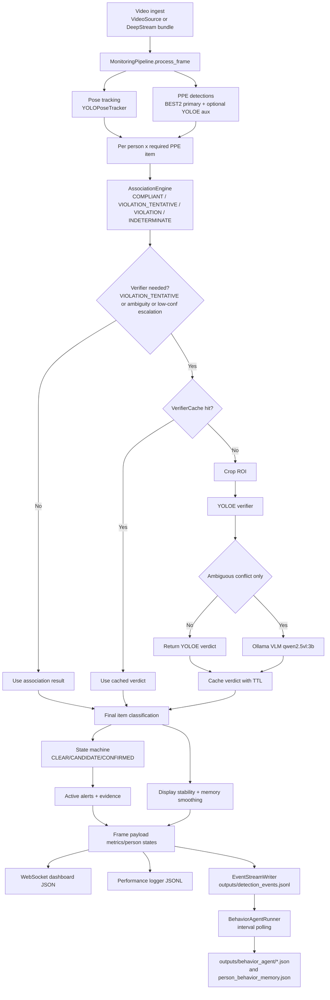
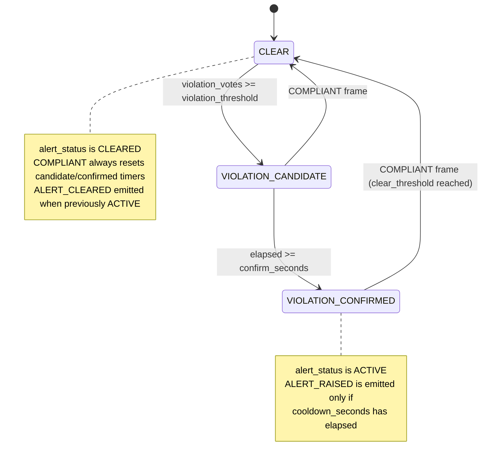

# PPE Compliance Monitoring (`ppe_monitor`)

## 1. Project overview

`ppe_monitor` is a real-time PPE compliance monitoring system for industrial safety video streams. It ingests webcam/file/RTSP video, tracks people, evaluates required PPE per person, applies anti-spam state logic, and publishes live results to a FastAPI WebSocket dashboard.

Primary users are operations/safety teams who need live compliance visibility, alert evidence, and machine-readable event logs for downstream analysis.

## 2. System architecture

### Video source (RTSP/file ingest)

- Python backend uses [`app/video_source.py`](app/video_source.py): OpenCV `VideoCapture`, optional frame dropping (`drop_grab_limit`), supports webcam index, file path, or RTSP URL.
- DeepStream backend uses [`app/deepstream/deepstream_pipeline.py`](app/deepstream/deepstream_pipeline.py): `uridecodebin + nvstreammux + nvinfer + nvtracker + appsink`.

### Pose detection (`yolo26n-pose`)

- Implemented in [`app/pose_tracker.py`](app/pose_tracker.py) (`YOLOPoseTracker`).
- Uses Ultralytics `.track(..., tracker="bytetrack.yaml")`.
- Produces tracked persons with COCO keypoints.

### PPE detection (`best2`)

- Implemented in [`app/ppe_detector.py`](app/ppe_detector.py) (`YOLOPPEDetector`).
- Primary detector labels are canonicalized through alias mapping (`ppe_label_aliases`).
- In startup logic, PPE model path is forced to `best2.onnx`/`best2.engine` when available for consistency (see [`app/startup_check.py`](app/startup_check.py)).

### Pose<->PPE association engine

- Implemented in [`app/association.py`](app/association.py).
- Rules are per item:
  - `helmet/goggles/gloves/boots`: distance from expected keypoints.
  - `coverall`: IoU with torso box from shoulder/hip keypoints.
- Handles held-items logic (`held_distance_ratio`) to flag "held but not worn".

### YOLOE verifier + verifier cache

- Verifier interface in [`app/verifier.py`](app/verifier.py).
- `YOLOEVerifier` is used for crop verification.
- `VerifierCache` in [`app/cache.py`](app/cache.py) stores verdicts by `(person_id, item)` with separate TTLs for compliant/violation/indeterminate.

### Ollama VLM verifier (`qwen2.5vl:3b`)

- Hybrid verifier mode is built in `load_runtime_components()` (`verifier.backend: ollama_hybrid`).
- Ollama VLM is trigger-driven (not unconditional per-frame): it is called only on ambiguity paths/low-confidence escalation, not for every person-item pair.
- Ambiguity/trigger rules are in [`app/pipeline.py`](app/pipeline.py) and [`app/verifier.py`](app/verifier.py).

### Compliance state machine with hysteresis

- Implemented in [`app/state_machine.py`](app/state_machine.py).
- Per-person, per-item rolling vote window.
- Internal stages: `CLEAR`, `VIOLATION_CANDIDATE`, `VIOLATION_CONFIRMED`.
- Emits transitions: `ALERT_RAISED`, `ALERT_CLEARED`.
- Includes confirm timer and alert cooldown.

### Memory / anti-spam logic

- Display-state stabilization + evidence memory in [`app/pipeline.py`](app/pipeline.py):
  - `status_stability.*`
  - `compliance_memory.*`
- Optional separate memory engine in [`app/ppe_memory.py`](app/ppe_memory.py), used by [`live_inference_window.py`](live_inference_window.py) with `--enable-memory`.

### Alert generation

- Active alerts are built from state machine active states in `_build_active_alerts()` in [`app/pipeline.py`](app/pipeline.py).
- Alert payload includes evidence JPEG (base64) when available.

### Event stream writer (`detection_events.jsonl`)

- Implemented in [`app/event_stream.py`](app/event_stream.py).
- Asynchronous queue + background writer thread (non-blocking to inference loop).
- Emits `ppe_observation` records on raw/stable/state transitions or heartbeat.

### Behavior intelligence agent (`qwen3:4b` via Ollama)

- Implemented in [`app/ai_behavior_agent/`](app/ai_behavior_agent).
- Reads recent events from `outputs/detection_events.jsonl`, runs periodic analysis, writes output files under `outputs/behavior_agent/`.
- Can run:
  - standalone CLI (`python -m app.ai_behavior_agent.agent ...`), or
  - optional background service in FastAPI (`behavior_agent.enabled: true`).

### FastAPI app + WebSocket dashboard

- Backend entrypoint: [`app/main.py`](app/main.py).
- WebSocket stream: `/ws/stream`.
- Optional websocket query override: `/ws/stream?jpeg=0` for JSON-only stream (no frame JPEG bytes).
- Dashboard static UI: [`static/index.html`](static/index.html), [`static/dashboard.js`](static/dashboard.js), [`static/styles.css`](static/styles.css).
- Exposes runtime/behavior/jetson/prometheus APIs.

### `live_inference_window.py` (OpenCV display)

- Local OpenCV viewer for direct inference visualization, without browser.
- Supports image/video sources, overlays, optional memory mode, optional status dashboard window.

### Performance logging

- Implemented in [`app/performance_logger.py`](app/performance_logger.py).
- Periodic async JSONL snapshots to `outputs/performance_logs.jsonl`.
- Includes fps, inference rates, estimated FLOP/s/TOPS, memory, optional Jetson stats, and DeepStream per-camera FPS when provided.

## 3. Pipeline diagram



## 4. State machine diagram

The following diagram is based on actual stage names and transitions in [`app/state_machine.py`](app/state_machine.py).



## 5. Installation

### Python and venv

Repository dependencies target Python 3.10 on Jetson (`requirements-jetson-orin-nano.txt`).

```bash
cd ppe_monitor
python3 -m venv .venv
source .venv/bin/activate
python -m pip install --upgrade pip setuptools wheel
pip install -r requirements-jetson-orin-nano.txt
```

### Required model files

Place models under `ppe_monitor/models/`.

Default config expects:

```text
models/yolo26n-pose.onnx
models/best2.onnx
models/yoloe-ppeRev2.onnx
models/det_2.5g.onnx        # if face_gate.enabled = true
```

If your filenames differ (for example `yoloe-ppe.onnx`), update `config.yaml` accordingly.

### Ollama setup

```bash
ollama serve
ollama pull qwen2.5vl:3b
ollama pull qwen3:4b
```

### Environment variables

No mandatory environment variables are required for the Python backend.

DeepStream deployments may require environment setup depending on device image:

```bash
# Example: expose DeepStream plugins when needed
export GST_PLUGIN_PATH=/opt/nvidia/deepstream/deepstream/lib/gst-plugins:${GST_PLUGIN_PATH}

# Example: used when compiling external DeepStream-Yolo parser
export CUDA_VER=12.6
```

## 6. Configuration (`config.yaml`)

All keys below are current defaults from [`config.yaml`](config.yaml).

### Video source and runtime backend

| Key | Default | Meaning |
|---|---|---|
| `video.source` | `videos/simulationTest2.mp4` | Webcam index, file path, or RTSP URI for Python backend. |
| `video.target_fps` | `20` | Target stream pacing. |
| `video.drop_grab_limit` | `3` | Max extra `.grab()` calls to catch up when lagging. |
| `runtime.backend` | `python` | Runtime backend: `python` or `deepstream`. |

### DeepStream group

| Key | Default |
|---|---|
| `deepstream.enabled` | `false` |
| `deepstream.source_uris` | `[]` |
| `deepstream.camera_ids` | `[]` |
| `deepstream.source_uri` | `""` |
| `deepstream.onnx_fallback_path` | `models/best2.onnx` |
| `deepstream.labels_path` | `configs/deepstream/labels_ppe.txt` |
| `deepstream.batch_size` | `1` |
| `deepstream.width` | `1280` |
| `deepstream.height` | `720` |
| `deepstream.live_source` | `true` |
| `deepstream.gie_config` | `configs/deepstream/config_infer_primary_yolo.txt` |
| `deepstream.tracker_config` | `configs/deepstream/config_tracker_NvDCF.yml` |
| `deepstream.tracker_ll_lib_file` | `/opt/nvidia/deepstream/deepstream/lib/libnvds_nvmultiobjecttracker.so` |
| `deepstream.engine_path` | `models/best2.engine` |
| `deepstream.person_classes` | `[person]` |
| `deepstream.label_map` | `{}` |
| `deepstream.output_metadata_topic` | `frame_payload` |
| `deepstream.enable_osd` | `false` |
| `deepstream.enable_display` | `false` |
| `deepstream.drop_frame_interval` | `0` |
| `deepstream.target_fps` | `30` |
| `deepstream.camera_id` | `rig_floor_cam_01` |
| `deepstream.emit_jpeg` | `true` |
| `deepstream.jpeg_quality` | `75` |
| `deepstream.jpeg_interval` | `1` |
| `deepstream.appsink_max_buffers` | `4` |

Meaning summary:
- If `source_uris` is non-empty, it is used (multi-camera).
- Otherwise single source fallback is `source_uri` then `video.source`.
- Runtime rewrites GIE config to absolute `engine/onnx/label` paths.

### Model paths and inference thresholds

| Key | Default | Meaning |
|---|---|---|
| `models.pose` | `models/yolo26n-pose.onnx` | Pose tracker model. |
| `models.ppe` | `models/best2.onnx` | Primary PPE detector model. |
| `models.verifier` | `models/yoloe-ppeRev2.onnx` | Verifier model. |
| `models.verifier_task` | `segment` | Ultralytics task hint for verifier model load. |
| `models.allow_mock_models` | `true` | Use mock components if model file missing. |
| `inference.device` | `auto` | Provider preference (`auto/cuda/cpu`). |
| `inference.conf_threshold_pose` | `0.40` | Pose confidence threshold. |
| `inference.conf_threshold_ppe` | `0.22` | PPE detection confidence threshold. |
| `inference.conf_threshold_verifier` | `0.45` | Verifier confidence threshold. |
| `inference.keypoint_conf_floor` | `0.40` | Global keypoint confidence floor. |
| `inference.imgsz` | `640` | Ultralytics inference image size. |

### PPE label aliases

`ppe_label_aliases.*` maps detector label variants to canonical classes used by the pipeline.
Defaults include aliases for:
- `helmet`, `goggles`, `gloves`, `boots`, `coverall`, `no_gloves`, `no_boots`, `harness`.

### Detector ensemble and verifier trigger logic

| Key | Default | Meaning |
|---|---|---|
| `detector_ensemble.enabled` | `true` | Enable auxiliary full-frame YOLOE detections. |
| `detector_ensemble.fusion_mode` | `parallel` | Merge strategy (`parallel` or NMS merge). |
| `detector_ensemble.nms_backend` | `auto` | NMS backend for merge mode (`auto`, `torchvision`, `cpu`). |
| `detector_ensemble.yoloe_conf_threshold` | `0.20` | Confidence for auxiliary YOLOE detector path. |
| `detector_ensemble.iou_nms_threshold` | `0.50` | NMS IoU for merge mode. |
| `detector_ensemble.allowed_items` | `[helmet, goggles, gloves, boots, coverall, no_gloves, no_boots, harness]` | Labels accepted from aux detector. |
| `verifier.backend` | `ollama_hybrid` | Verifier mode. |
| `verifier.enable_vlm` | `true` | Enable Ollama escalation in hybrid verifier. |
| `verifier.ollama.host` | `http://127.0.0.1:11434` | Ollama host. |
| `verifier.ollama.model` | `qwen2.5vl:3b` | VLM model for conflict resolution. |
| `verifier.ollama.timeout_seconds` | `8.0` | Ollama request timeout. |
| `verifier.ollama.temperature` | `0.0` | Ollama temperature. |
| `verifier.ollama.jpeg_backend` | `auto` | JPEG backend for VLM payloads (`auto`, `nvjpeg`, `cpu`). |
| `verifier.ollama.jpeg_quality` | `85` | JPEG quality for VLM payload crops. |
| `verifier.conflict_resolver.min_iou` | `0.05` | Minimum overlap for conflict analysis. |
| `verifier.conflict_resolver.ambiguity_margin` | `0.12` | Positive/negative score margin for ambiguity. |
| `verifier.conflict_resolver.low_conf_threshold` | `0.40` | Low confidence threshold in conflict logic. |
| `verifier.low_conf_escalation.enabled` | `true` | Force verifier for low-confidence compliant detections. |
| `verifier.low_conf_escalation.threshold` | `0.40` | Default low-confidence escalation threshold. |
| `verifier.low_conf_escalation.items` | `[gloves]` | Items using low-confidence escalation. |
| `verifier.low_conf_escalation.per_item_thresholds.gloves` | `0.40` | Item-specific threshold. |
| `verifier.label_polarity.*` | per-item positive/negative class map | Defines conflict pairs (for example `gloves` vs `no_gloves`). |
| `verifier.vlm_labels.*` | per-item prompt strings | Human-readable labels for VLM prompt. |

### Association and ROI

| Key | Default |
|---|---|
| `association.keypoint_conf_floor` | `0.40` |
| `association.held_distance_ratio` | `1.2` |
| `association.held_items` | `[helmet, goggles, gloves]` |
| `association.goggles_face_gate_enabled` | `true` |
| `association.goggles_face_min_points` | `2` |
| `association.helmet_keypoints` | `[nose, left_eye, right_eye]` |
| `association.goggles_keypoints` | `[left_eye, right_eye]` |
| `association.gloves_keypoints` | `[left_wrist, right_wrist]` |
| `association.boots_keypoints` | `[left_ankle, right_ankle]` |
| `association.coverall_keypoints` | `[left_shoulder, right_shoulder, left_hip, right_hip]` |
| `association.helmet_distance_px` | `90` |
| `association.goggles_distance_px` | `85` |
| `association.gloves_distance_px` | `110` |
| `association.boots_distance_px` | `120` |
| `association.coverall_iou_threshold` | `0.05` |
| `verifier_roi.keypoint_conf_floor` | `0.40` |
| `verifier_roi.min_side_px` | `96` |
| `verifier_roi.padding_scale.helmet` | `2.0` |
| `verifier_roi.padding_scale.goggles` | `1.8` |
| `verifier_roi.padding_scale.gloves` | `1.6` |
| `verifier_roi.padding_scale.boots` | `1.6` |
| `verifier_roi.padding_scale.coverall` | `1.25` |

### State machine and stability

| Key | Default | Meaning |
|---|---|---|
| `state_machine.window_size` | `30` | Rolling vote window size. |
| `state_machine.violation_threshold` | `40` | Violation-like votes needed for candidate stage. |
| `state_machine.clear_threshold` | `1` | Compliant streak needed to clear active alert. |
| `state_machine.confirm_seconds` | `2.0` | Candidate duration required before confirmed stage. |
| `state_machine.cooldown_seconds` | `60.0` | Cooldown between repeated `ALERT_RAISED`. |
| `status_stability.compliant_enter_frames` | `2` | Frames required to enter compliant display state. |
| `status_stability.compliant_clear_violation_frames` | `3` | Frames required to clear violation display state. |
| `status_stability.violation_enter_frames` | `4` | Frames required to enter violation display state. |
| `status_stability.indeterminate_enter_frames` | `8` | Frames required to enter indeterminate display state. |
| `status_stability.per_item.helmet.violation_enter_frames` | `7` | Item override. |
| `status_stability.per_item.helmet.indeterminate_enter_frames` | `12` | Item override. |
| `status_stability.per_item.coverall.violation_enter_frames` | `7` | Item override. |
| `status_stability.per_item.coverall.indeterminate_enter_frames` | `12` | Item override. |

### Compliance memory smoothing

| Key | Default |
|---|---|
| `compliance_memory.assume_compliant` | `true` |
| `compliance_memory.prior_compliant_score` | `5.0` |
| `compliance_memory.decay` | `0.96` |
| `compliance_memory.positive_gain` | `1.0` |
| `compliance_memory.negative_gain` | `1.25` |
| `compliance_memory.compliant_bonus` | `1.0` |
| `compliance_memory.violation_penalty` | `1.2` |
| `compliance_memory.indeterminate_decay` | `0.985` |
| `compliance_memory.ok_threshold` | `4.0` |
| `compliance_memory.bad_threshold` | `-4.0` |
| `compliance_memory.dominance_ratio` | `1.15` |
| `compliance_memory.dominance_min_negative` | `2.5` |
| `compliance_memory.max_abs_score` | `20.0` |

### Required PPE and dashboard

| Key | Default |
|---|---|
| `required_ppe` | `[helmet, goggles, gloves, boots, coverall]` |
| `dashboard.jpeg_quality` | `75` |
| `dashboard.jpeg_backend` | `auto` |
| `dashboard.stream_jpeg_enabled` | `true` |
| `dashboard.jpeg_interval_frames` | `1` |
| `dashboard.max_stream_clients` | `1` |
| `dashboard.metrics_window_minutes` | `60` |

### Compute, memory, and logging

| Key | Default |
|---|---|
| `compute_monitor.enabled` | `true` |
| `compute_monitor.pose_gflops_per_infer` | `8.5` |
| `compute_monitor.ppe_gflops_per_infer` | `20.0` |
| `compute_monitor.verifier_aux_gflops_per_infer` | `20.0` |
| `compute_monitor.verifier_crop_gflops_per_infer` | `20.0` |
| `compute_monitor.verifier_ollama_gflops_per_infer` | `0.0` |
| `compute_monitor.device_peak_gflops` | `8500.0` |
| `memory_monitor.enabled` | `true` |
| `performance_logging.enabled` | `true` |
| `performance_logging.path` | `outputs/performance_logs.jsonl` |
| `performance_logging.interval_seconds` | `1.0` |
| `performance_logging.queue_max` | `5000` |
| `performance_logging.include_jetson` | `true` |
| `performance_logging.include_raw_metrics` | `true` |
| `performance_logging.camera_id` | `rig_floor_cam_01` |

### Prometheus and Jetson bridge

| Key | Default |
|---|---|
| `prometheus.enabled` | `true` |
| `jetson_exporter.enabled` | `true` |
| `jetson_exporter.mode` | `local_jtop` |
| `jetson_exporter.url` | `http://127.0.0.1:9100/metrics` |
| `jetson_exporter.timeout_seconds` | `1.5` |
| `jetson_exporter.refresh_seconds` | `1.0` |
| `jetson_exporter.fallback_to_local_jtop` | `true` |
| `jetson_exporter.metric_map` | `{}` |

### Face gate, event stream, behavior agent, logging

| Key | Default |
|---|---|
| `face_gate.enabled` | `true` |
| `face_gate.target_item` | `goggles` |
| `face_gate.shadow_mode` | `true` |
| `face_gate.enforce` | `false` |
| `face_gate.log_enabled` | `true` |
| `face_gate.log_every_n_frames` | `10` |
| `face_gate.scrfd_model_path` | `models/det_2.5g.onnx` |
| `face_gate.input_size` | `640` |
| `face_gate.score_threshold` | `0.35` |
| `face_gate.min_confidence` | `0.45` |
| `face_gate.min_face_area_ratio` | `0.02` |
| `face_gate.nms_iou_threshold` | `0.40` |
| `face_gate.gpu_preprocess` | `true` |
| `face_gate.decode_backend` | `auto` |
| `face_gate.nms_backend` | `auto` |
| `face_gate.cache_seconds` | `0.2` |
| `event_stream.enabled` | `true` |
| `event_stream.path` | `outputs/detection_events.jsonl` |
| `event_stream.camera_id` | `rig_floor_cam_01` |
| `event_stream.heartbeat_seconds` | `1.0` |
| `event_stream.emit_on_raw_change` | `true` |
| `event_stream.emit_on_stable_change` | `true` |
| `event_stream.emit_on_sm_transition` | `true` |
| `event_stream.queue_max` | `2000` |
| `behavior_agent.enabled` | `false` |
| `behavior_agent.interval_seconds` | `10` |
| `behavior_agent.events_jsonl` | `outputs/detection_events.jsonl` |
| `behavior_agent.output_dir` | `outputs/behavior_agent` |
| `behavior_agent.memory_path` | `outputs/person_behavior_memory.json` |
| `behavior_agent.host` | `http://127.0.0.1:11434` |
| `behavior_agent.model` | `qwen3:4b` |
| `behavior_agent.max_recent_events` | `30` |
| `behavior_agent.temperature` | `0.1` |
| `behavior_agent.num_predict` | `2048` |
| `behavior_agent.num_ctx` | `8192` |
| `behavior_agent.strict_json` | `true` |
| `behavior_agent.update_memory` | `true` |
| `behavior_agent.min_identity_confidence` | `0.65` |
| `behavior_agent.identity_switch_reid_threshold` | `0.70` |
| `behavior_agent.save_training_records` | `true` |
| `behavior_agent.timeout_seconds` | `90` |
| `logging.structured` | `true` |

## 7. Running the system

### FastAPI dashboard

```bash
cd ppe_monitor
uvicorn app.main:app --host 0.0.0.0 --port 8000
```

Open:

```text
http://127.0.0.1:8000
```

### `live_inference_window.py`

```bash
cd ppe_monitor
python live_inference_window.py --source videos/simulationTest2.mp4 --show-skeleton
```

What it shows:
- OpenCV video with PPE boxes, person states, reasons, and metrics overlay.
- Optional second status window.
- Optional memory/anti-spam mode and compliance event JSONL output.

### Behavior agent

Enable in-app background mode (`config.yaml`):

```yaml
behavior_agent:
  enabled: true
```

Or run standalone (recommended for debugging):

```bash
python -m app.ai_behavior_agent.agent \
  --config config.yaml \
  --events-jsonl outputs/detection_events.jsonl \
  --interval 5 \
  --model qwen3:4b \
  --host http://127.0.0.1:11434
```

One-shot cycle:

```bash
python -m app.ai_behavior_agent.agent --config config.yaml --once
```

Interval semantics:
- Each cycle reads up to `max_recent_events` recent `ppe_observation` events.
- It writes latest/history outputs per cycle.
- Failures (timeout/invalid JSON) are skipped safely and do not block the pipeline.

## 8. Models

| File | Role in code | Runtime input expectation | Source/provenance |
|---|---|---|---|
| `models/yolo26n-pose.onnx` | Person pose + tracking (`YOLOPoseTracker`) | Inference size `inference.imgsz` (default `640`) via Ultralytics | YOLO pose family artifact; exact training provenance not declared in this repo. |
| `models/best2.onnx` | Primary PPE detector (`YOLOPPEDetector`) | Inference size `inference.imgsz` (default `640`) | Custom PPE detector artifact; exact dataset/training recipe is not fully documented in code. |
| `models/yoloe-ppeRev2.onnx` | Verifier model (crop verification + optional aux full-frame detections) | Inference size `inference.imgsz` (default `640`) | YOLOE-based verifier artifact; exact training provenance not declared in code. |
| `models/det_2.5g.onnx` | SCRFD face detector for goggles face gate | `face_gate.input_size` (default `640`) | SCRFD detector artifact. |
| `models/w600k_mbf.onnx` | ArcFace backbone candidate | Not used in runtime pipeline currently | ArcFace model artifact, currently not integrated in `MonitoringPipeline`. |

Notes:
- In the current repository snapshot, `config.yaml` points to `models/yoloe-ppeRev2.onnx`; if you only have `models/yoloe-ppe.onnx`, update config.
- DeepStream primary detector expects TensorRT engine (`best2.engine`/`.plan`) plus parser-compatible config.

### TensorRT export commands

Primary detector (`best2`) engine export:

```bash
yolo export model=models/best2.pt format=engine device=0 half=True imgsz=640
```

Alternative `trtexec` minimal command:

```bash
/usr/src/tensorrt/bin/trtexec \
  --onnx=models/best2.onnx \
  --saveEngine=models/best2.engine \
  --fp16
```

Face/identity candidate engines (not yet integrated into runtime decision path):

```bash
/usr/src/tensorrt/bin/trtexec --onnx=models/det_2.5g.onnx --saveEngine=models/scrfd_2.5g_fp16.plan --fp16
/usr/src/tensorrt/bin/trtexec --onnx=models/w600k_mbf.onnx --saveEngine=models/arcface_mbf_fp16.plan --fp16
```

## 9. Outputs

### `outputs/detection_events.jsonl`

- Writer: [`app/event_stream.py`](app/event_stream.py)
- Trigger: raw/stable/state change or heartbeat.
- Record schema:

```json
{
  "schema_version": "1.0",
  "event_id": "<ms>-<seq>",
  "event_type": "ppe_observation",
  "timestamp": "ISO-8601 UTC",
  "camera_id": "rig_floor_cam_01",
  "frame_id": 123,
  "track_id": 5,
  "person_memory_id": null,
  "bbox": [x1, y1, x2, y2],
  "ppe": {
    "helmet": {
      "status": "COMPLIANT|VIOLATION|INDETERMINATE|VIOLATION_TENTATIVE",
      "status_stable": "COMPLIANT|VIOLATION|INDETERMINATE",
      "positive_conf": 0.0,
      "negative_conf": 0.0,
      "reason": "string",
      "sm_stage": "CLEAR|VIOLATION_CANDIDATE|VIOLATION_CONFIRMED",
      "alert_status": "ACTIVE|CLEARED"
    }
  },
  "overall_status": "COMPLIANT|VIOLATION|INDETERMINATE",
  "tracker": {
    "tracking_confidence": null,
    "reid_similarity": null,
    "occlusion": null
  },
  "zone": null,
  "risk_context": null
}
```

### `outputs/behavior_agent/latest_behavior_insight.json` and history

- Writer: [`app/ai_behavior_agent/storage.py`](app/ai_behavior_agent/storage.py)
- Files:
  - `outputs/behavior_agent/latest_behavior_insight.json`
  - `outputs/behavior_agent/history/behavior_agent_<timestamp>.json`
- Canonical schema (normalized by [`app/ai_behavior_agent/schemas.py`](app/ai_behavior_agent/schemas.py)):

```json
{
  "agent_type": "background_behavior_intelligence",
  "model": "qwen3:4b",
  "generated_at": "ISO-8601 UTC",
  "time_window": {
    "start": "ISO-8601 or null",
    "end": "ISO-8601 or null",
    "event_count": 0
  },
  "summary": "string",
  "detected_patterns": [
    {
      "type": "repeated_ppe_violation|possible_identity_switch|possible_false_violation|alert_flicker|zone_risk_pattern",
      "description": "string",
      "confidence": 0.0,
      "track_ids": [11],
      "evidence": "string"
    }
  ],
  "memory_update_recommendations": [
    {
      "track_id": 11,
      "action": "flag_possible_identity_switch|set_review_needed|mark_violation_unconfirmed|append_anomaly_flag|store_dashboard_insight|store_training_label"
    }
  ],
  "dashboard_insights": [
    {"title": "Insight", "detail": "string", "confidence": 0.0}
  ],
  "training_data_suggestions": [
    {"track_id": 11, "label_hint": "string", "reason": "string"}
  ]
}
```

Additional behavior-agent files:
- `outputs/behavior_agent/training_records.jsonl` (when `save_training_records: true`)
- `outputs/behavior_agent/debug/invalid_response_<ts>.txt` (invalid Ollama JSON debug capture)
- `outputs/person_behavior_memory.json` (allowlisted memory updates)

### `outputs/performance_logs.jsonl`

- Writer: [`app/performance_logger.py`](app/performance_logger.py)
- Trigger: periodic (`performance_logging.interval_seconds`).
- Record schema:

```json
{
  "schema_version": "1.0",
  "event_type": "performance_snapshot",
  "event_id": "<ms>-<seq>",
  "timestamp": "ISO-8601 UTC",
  "timestamp_epoch": 0.0,
  "backend": "python|deepstream",
  "frame_id": 0,
  "source": "websocket_stream|websocket_stream_deepstream|live_window_*",
  "source_id": 0,
  "camera_id": "rig_floor_cam_01",
  "input_fps": 0.0,
  "processed_fps": 0.0,
  "dropped_frames": 0,
  "object_count": 0,
  "primary_infer_latency_ms": 0.0,
  "tracker_latency_ms": 0.0,
  "end_to_end_latency_ms": 0.0,
  "cpu_percent": 0.0,
  "gpu_percent": 0.0,
  "ram_percent": 0.0,
  "temperature_c": 0.0,
  "verifier_calls_per_sec": 0.0,
  "ollama_calls_per_sec": 0.0,
  "summary": {},
  "compute": {},
  "model_rates": {},
  "memory": {},
  "per_camera_fps": {"rig_floor_cam_01": 0.0},
  "jetson": {},
  "metrics": {}
}
```

`per_camera_fps` appears when DeepStream bundle camera FPS map is available.

### Alerts file (`outputs/compliance_events.jsonl`)

- Writer: [`app/compliance_events.py`](app/compliance_events.py)
- Used by: [`live_inference_window.py`](live_inference_window.py) only when `--enable-memory` is set.
- FastAPI dashboard path does not write this file by default.
- Record schema:

```json
{
  "timestamp": "ISO-8601 UTC",
  "event_type": "PPE_VIOLATION_CONFIRMED",
  "camera_id": "string",
  "track_id": 12,
  "state": "VIOLATION_CONFIRMED",
  "item_statuses": {
    "helmet": "OK|VIOLATION|UNKNOWN|UNCLEAR",
    "coverall": "OK|VIOLATION|UNKNOWN|UNCLEAR",
    "gloves": "OK|VIOLATION|UNKNOWN|UNCLEAR",
    "safety_glasses": "OK|VIOLATION|UNKNOWN|UNCLEAR",
    "boots": "OK|VIOLATION|UNKNOWN|UNCLEAR"
  },
  "bbox": [x1, y1, x2, y2]
}
```

## 10. Performance notes

- Repository status on Jetson Orin Nano Super benchmark:
  - Use [`docs/perf_baseline_python.md`](docs/perf_baseline_python.md) for the 3-test N=2 baseline workflow.
  - You can run the baseline workflow with `bash scripts/run_phase0_tests.sh`.
  - For throughput-focused runs, add `--ws-no-jpeg` to remove websocket JPEG encode/transport overhead.
  - Artifacts are written under `outputs/phase0_<timestamp>/` (per-test uvicorn logs, tegrastats logs, py-spy SVG, websocket summaries).
- Known bottlenecks from current implementation:
  - Python hot path still performs pose tracking and post-processing per frame.
  - Optional detector ensemble adds extra full-frame YOLOE inference.
  - Verifier crop calls increase load on ambiguous or low-confidence cases.
  - If VLM escalation is triggered, Ollama request latency can stall that decision path until timeout/response.
  - DeepStream mode still routes frame data back into Python pipeline for pose/compliance logic.
- Expect FPS degradation when:
  - Input resolution/FPS is high,
  - multiple people are present,
  - `verifier.low_conf_escalation` triggers often,
  - Ollama responses are slow,
  - system memory pressure causes paging.

## 11. Roadmap

- DeepStream 7.1 backend hardening for production parser compatibility and stable acceleration gains.
- Face identity layer (SCRFD + ArcFace TensorRT engines are prepared, runtime integration pending).
- PostgreSQL event mirror to head office.
- Multi-camera scaling with stronger per-camera isolation and throughput controls.

## 12. Troubleshooting

### Ollama not responding / timeout

Symptoms:
- behavior agent logs `ollama_request_failed` or timeout.
- verifier path returns indeterminate from Ollama.

Checks:

```bash
curl -s http://127.0.0.1:11434/api/tags
ollama serve
```

Fixes:
- Ensure Ollama daemon is running.
- Verify `verifier.ollama.host` and `behavior_agent.host`.
- Increase timeout values if model is too slow.

### Behavior agent returns invalid JSON / empty insights

Symptoms:
- `invalid_json_response` cycle skip.
- latest insight remains empty/default.

Checks:

```bash
ls outputs/behavior_agent/debug
```

Fixes:
- Inspect `invalid_response_*.txt` in debug folder.
- Keep `strict_json: true` and `think: false` (already enforced).
- Reduce prompt load (`max_recent_events`) if context is too large.

### Model files missing / wrong filename

Symptoms:
- startup `FileNotFoundError` or unexpected mock mode.

Checks:

```bash
ls models
```

Fixes:
- Place required ONNX/engine files in `models/`.
- Align `config.yaml` model paths with actual filenames.

### RTSP/file source open failure

Symptoms:
- `Unable to open video source: ...` from `VideoSource.open()`.

Fixes:
- Validate path/URI and file permissions.
- Test source with plain OpenCV/ffplay first.
- For Jetson, confirm codec support in GStreamer/OpenCV build.

### CUDA library/provider mismatch

Symptoms:
- ONNX models run on `CPUExecutionProvider` unexpectedly.

Checks:

```bash
python -c "import onnxruntime as ort; print(ort.get_available_providers())"
```

Fixes:
- Install compatible `onnxruntime-gpu` for Jetson stack.
- Ensure CUDA/TensorRT versions match JetPack.
- Review startup logs from `model_startup_check`.

### Port already in use

Symptoms:
- `address already in use` for uvicorn/prometheus/exporter.

Fixes:

```bash
# choose a different port
uvicorn app.main:app --host 0.0.0.0 --port 8001
prometheus --config.file=monitoring/prometheus.yml --web.listen-address=0.0.0.0:9091
```

### DeepStream dependency failure (`No module named gi` / `pyds` missing)

Symptoms:
- startup error from `DeepStreamUnavailableError`.

Fixes:
- Follow [`docs/deepstream_jetson_setup.md`](docs/deepstream_jetson_setup.md).
- Install `pyds`, verify GStreamer plugins, and confirm DeepStream plugin paths.

### DeepStream parser crash (`Could not find output coverage layer`)

Symptoms:
- nvinfer parse error and segmentation fault.

Fixes:
- Ensure your GIE config matches YOLO output parser requirements.
- Verify custom parser library path and function names in DeepStream config.
- Rebuild engine/config pair on the same target runtime.

