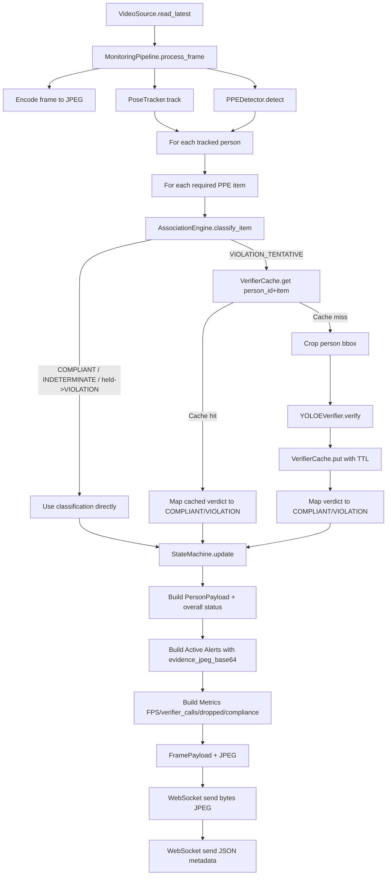
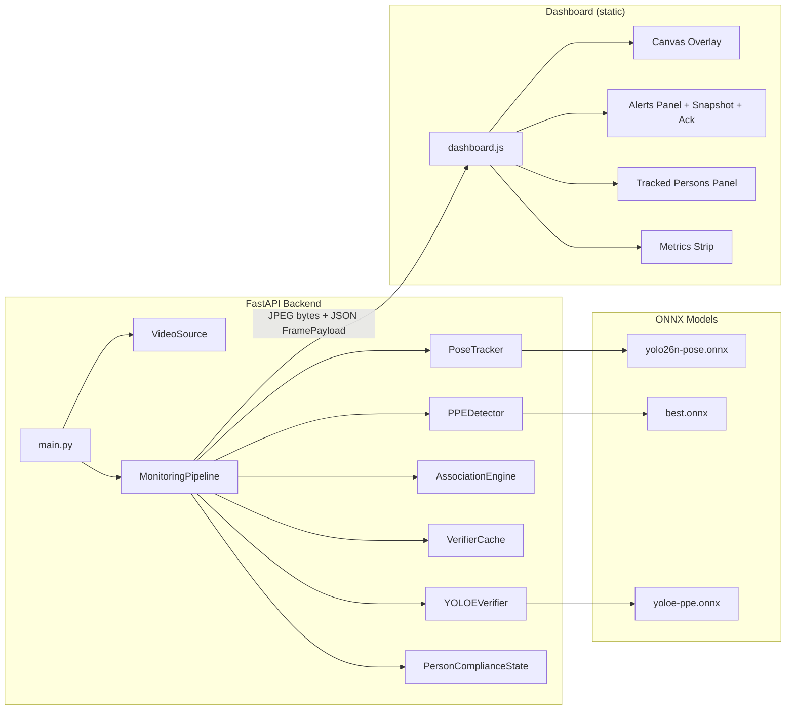

# PPE Compliance Monitoring Prototype

Real-time PPE compliance monitoring using a three-model ONNX cascade:

- Pose + tracking: `models/yolo26n-pose.onnx`
- PPE detection: `models/best2.onnx`
- Verifier: `models/yoloe-ppe.onnx`

The system uses tracked persons, keypoint-aware PPE association, verifier cache TTLs, and a per-item alert state machine with hysteresis.

## Latest Features (May 2026)

- Added a non-blocking per-person event stream at `outputs/detection_events.jsonl`.
  - Source: `app/pipeline.py` + `app/event_stream.py`
  - Trigger policy: raw-status change, stabilized-status change, state-machine stage change, or heartbeat.
- Added a background AI behavior intelligence agent package:
  - `app/ai_behavior_agent/` (reader, prompting, Ollama client, schemas, storage, memory reinforcer, runner CLI)
  - Uses Ollama `qwen3:4b` with `think: false` and strict JSON parsing.
  - Runs as standalone by default, optional background service inside FastAPI when enabled.
- Added read-only APIs:
  - `GET /api/behavior-agent/latest`
  - `GET /api/behavior-agent/history`
  - `GET /api/behavior-agent/memory`
- Added dashboard panel: **AI Behavior Intelligence**.

Detailed feature notes: `BEHAVIOR_AGENT.md`.

## Quick Start

```bash
python3 -m pip install --upgrade pip setuptools wheel
python3 -m pip install -r requirements-jetson-orin-nano.txt
```

For Jetson Orin Nano Super, use `requirements-jetson-orin-nano.txt`.

Drop models into `models/`:

- `models/yolo26n-pose.onnx`
- `models/best2.onnx`
- `models/yoloe-ppe.onnx`

Run:

```bash
uvicorn app.main:app --reload
```

Open dashboard at `http://localhost:8000`.

## Model Preparation

- Export ONNX with opset 17+ when possible.
- Use `dynamic=True` when you hit shape compatibility issues.
- Keep task settings aligned:
  - pose model with `task='pose'`
  - PPE/verifier models with `task='detect'`

If preprocessing errors occur, inspect input/output tensor names and shapes with Netron and compare with startup logs.

## Configuration

All thresholds and behavior are in `config.yaml`.

- `video.source`: webcam index, file path, or RTSP URL
- `video.target_fps`: desired streaming cadence
- `video.drop_grab_limit`: max extra `.grab()` operations to catch up when slow
- `models.pose|ppe|verifier`: ONNX paths
- `models.allow_mock_models`: if true, missing models are replaced with mocks
- `inference.device`: `auto`, `cuda`, or `cpu`
- `inference.conf_threshold_pose|ppe|verifier`: score thresholds per model
- `inference.keypoint_conf_floor`: below this keypoint confidence => `INDETERMINATE`
- `inference.imgsz`: inference image size
- `association.*`: PPE binding distances, keypoint sets, coverall IoU threshold, held-distance ratio
  - `association.goggles_face_gate_enabled`: require face visibility before goggles can be judged compliant/non-compliant
  - `association.goggles_face_min_points`: minimum visible face keypoints for goggles assessment
- `face_gate.*`: optional SCRFD face-visibility gate for goggles
  - `enabled`: enable SCRFD face observations
  - `shadow_mode`: log-only, no decision override
  - `enforce`: override goggles to `INDETERMINATE` when face is not visible
  - `scrfd_model_path`: SCRFD ONNX model path
- `verifier_cache.ttl_compliant_seconds|ttl_violation_seconds`: cache TTLs per verifier result
- `state_machine.window_size`: rolling window length
- `state_machine.violation_threshold`: raise alert on this many violations in window
- `state_machine.clear_threshold`: clear alert after this many consecutive compliant frames
- `event_stream.*`: non-blocking richer per-person observation JSONL settings
- `behavior_agent.*`: background behavior intelligence agent settings (`enabled` defaults to `false`)
- `required_ppe`: PPE items to enforce
- `dashboard.jpeg_quality`: JPEG quality used for stream frames
- `dashboard.metrics_window_minutes`: time window used for dashboard aggregate metrics
- `compute_monitor.*`: estimated runtime compute-power monitor (GFLOPS/s)
  - `compute_monitor.enabled`: enable/disable compute estimation in metrics/dashboard
  - `pose_gflops_per_infer|ppe_gflops_per_infer|verifier_aux_gflops_per_infer|verifier_crop_gflops_per_infer|verifier_ollama_gflops_per_infer`: per-model estimate inputs
  - `device_peak_gflops`: optional hardware peak for utilization percentage
- `memory_monitor.enabled`: process/system memory monitoring
- `prometheus.enabled`: enable `/metrics` Prometheus export endpoint
- `jetson_exporter.*`: optional bridge to jtop-based Jetson Prometheus exporter
  - `enabled`: enable bridge
  - `mode`: `external` or `local_jtop`
  - `url`: exporter metrics URL (default `http://127.0.0.1:9100/metrics`)
  - `timeout_seconds`: fetch timeout
  - `refresh_seconds`: cache interval for Jetson stats polling
  - `fallback_to_local_jtop`: when `external` fails, try direct local jtop
  - `metric_map`: optional metric-name overrides per normalized field

### Ollama VLM Verifier (Qwen2.5-VL 3B)

The verifier can run in hybrid mode:

- YOLOE verifier model stays the fast path.
- Ollama VLM is called only on ambiguous positive-vs-negative detections
  (for example `boots` vs `no_boots`, `gloves` vs `no_gloves`).

Config keys:

- `verifier.backend: ollama_hybrid`
- `verifier.ollama.host` (default `http://127.0.0.1:11434`)
- `verifier.ollama.model` (default `qwen2.5vl:3b`)
- `verifier.conflict_resolver.*` for ambiguity thresholds
- `verifier.label_polarity.*` maps positive/negative detector classes per item

The pipeline converts uncertain VLM answers to `INDETERMINATE`, which reduces
dashboard alert spam by design due to state-machine hysteresis.

### Compute Power Monitoring (Estimated FLOPS)

The dashboard now reports estimated compute load from active inference calls:

- `estimated_flops_per_sec` (FLOP/s)
- `estimated_gflops_per_sec`
- `estimated_tflops_per_sec`
- `estimated_tops_per_sec`
- `estimated_compute_utilization_pct` (when `device_peak_gflops > 0`)

Important: this is an estimate derived from configured per-model GFLOPs and observed calls/sec.
It is not a hardware counter from GPU performance registers.

Model coverage includes:

- pose tracker model
- PPE primary model (`best2`)
- verifier auxiliary full-frame detector (`yoloe_aux`)
- verifier crop model calls
- verifier Ollama calls (if a per-call estimate is configured)

The dashboard also includes a dedicated **Computation Performance** panel with:

- overall FLOP/s, GFLOP/s, TFLOP/s
- per-model FLOP/s breakdown
- process RSS/VMS memory and system memory usage

### Grafana / Prometheus Integration

The app now exposes a Prometheus endpoint:

- `GET /metrics`

It exports live gauges for:

- FPS, tracked count, active violations, dropped frames
- estimated FLOP/s, GFLOP/s, TFLOP/s, TOPS, utilization
- per-model inference rates (pose, PPE, verifier aux/crop, verifier ollama)
- process/system memory metrics
- event stream dropped writes
- normalized Jetson exporter gauges (`ppe_monitor_jetson_*`)

Quick check:

```bash
curl -s http://127.0.0.1:8000/metrics | head
```

Starter files included:

- Prometheus config: `monitoring/prometheus.yml`
- Grafana dashboard JSON: `monitoring/grafana/ppe_monitor_dashboard.json`

Prometheus run example:

```bash
prometheus --config.file=monitoring/prometheus.yml
```

Grafana import:

1. Add Prometheus datasource in Grafana.
2. Import `monitoring/grafana/ppe_monitor_dashboard.json`.
3. Select your Prometheus datasource when prompted.

Jetson jtop exporter integration modes:

1. Grafana mode:
   - Prometheus scrapes this app (`/metrics`) and optionally the raw Jetson exporter (`:9100/metrics`).
   - Use included dashboard panels for `ppe_monitor_jetson_*`.
2. Own dashboard mode:
   - Web UI fetches `GET /api/jetson/stats` and shows a live Jetson card in **Computation Performance**.
3. Uvicorn-only mode (no separate exporter process):
   - Set:
     ```yaml
     jetson_exporter:
       enabled: true
       mode: "local_jtop"
       refresh_seconds: 1.0
     ```
   - Install `jetson-stats` in your venv.
   - Run only `uvicorn app.main:app --reload`.
   - The app reads jtop directly for `/api/jetson/stats` and `/metrics`.

If you do not already have a Jetson exporter process, you can run the included script:

```bash
pip install -U jetson-stats prometheus-client
python monitoring/jetson_jtop_exporter.py --host 0.0.0.0 --port 9100 --interval 1
```

Then verify:

```bash
curl -s http://127.0.0.1:9100/metrics | head
```

Jetson calibration preset:

- `compute_monitor.device_peak_gflops: 8500` for Jetson Orin Nano 8GB standard mode
- `compute_monitor.device_peak_gflops: 17000` for Jetson Orin Nano Super mode

### Background Behavior Intelligence Agent (Qwen3 4B)

This is a separate best-effort analytics layer and does **not** override safety logic.

- Input stream: `outputs/detection_events.jsonl` (not `compliance_events.jsonl`)
- Model: `qwen3:4b`
- Endpoint used: Ollama `/api/generate`
- Request constraints: `format: "json"` and `think: false`
- Default mode: disabled in `config.yaml` (`behavior_agent.enabled: false`)

Standalone run (recommended):

```bash
python -m app.ai_behavior_agent.agent \
  --config config.yaml \
  --events-jsonl outputs/detection_events.jsonl \
  --interval 5 \
  --once \
  --model qwen3:4b \
  --host http://127.0.0.1:11434
```

Outputs:

- `outputs/behavior_agent/latest_behavior_insight.json`
- `outputs/behavior_agent/history/behavior_agent_<timestamp>.json`
- `outputs/behavior_agent/training_records.jsonl` (when enabled)
- `outputs/person_behavior_memory.json` (safe allowlisted updates only)

Safety constraints:

- Agent never confirms final violations.
- Agent never overrides the state machine or detector thresholds.
- If Ollama is unavailable or emits invalid JSON, cycle is skipped safely.

### Behavior Agent API

When FastAPI is running, these read-only endpoints are available:

- `GET /api/behavior-agent/latest`
- `GET /api/behavior-agent/history`
- `GET /api/behavior-agent/memory`

If files are missing, each endpoint returns a safe empty payload.

### PPE Compliance Memory / Anti-Spam Status

Frame-by-frame detection can cause dashboard status flicker (`OK -> VIOLATION -> OK`)
when detections momentarily fail due to blur, occlusion, or motion.

This project includes an optional memory layer for the same tracked `track_id`
within the same camera/session:

- per-item temporal voting in a recent frame window
- per-track state machine (`*_CANDIDATE` -> `*_CONFIRMED`)
- stable status hold during short unclear flicker
- alert cooldown to prevent duplicate alert spam

This first version does **not** perform long-term identity re-identification. If
a person leaves and returns with a new `track_id`, they are treated as a new track.

Runtime entry script for this mode: `live_inference_window.py`

```bash
python3 live_inference_window.py \
  --source ./videos/simulationTest2.mp4 \
  --ppe-model models/best2.engine \
  --device 0 \
  --imgsz 640 \
  --enable-memory \
  --memory-window 30 \
  --alert-cooldown 60 \
  --events-jsonl outputs/compliance_events.jsonl
```

Live inference now also emits richer `ppe_observation` analytics records (when `event_stream.enabled: true`) to:

- `outputs/detection_events.jsonl`

That stream is the input for the background behavior agent.

### SCRFD Goggles Face Gate (Shadow + Optional Enforcement)

Goal: avoid false goggles violations when the face is not visible (back-facing / severe occlusion).

Behavior:

- In `shadow_mode`, app logs `face_gate_observation` events but keeps current decisions unchanged.
- In `enforce` mode, if face is not visible for goggles item, result is forced to `INDETERMINATE`.

Recommended rollout:

1. Start with shadow mode only:
   ```yaml
   face_gate:
     enabled: true
     shadow_mode: true
     enforce: false
   ```
2. Review logs for `face_gate_observation`.
3. If results are good, switch to:
   ```yaml
   face_gate:
     enforce: true
   ```

Note: current built-in face gate backend expects SCRFD ONNX model path (`.onnx`).

## ONNX Caveats

- TensorRT export is the next optimization step once ONNX flow is stable.
- Verify each model's input shape and output assumptions before debugging association logic.
- YOLOE text-prompt inference usually does not survive ONNX export. The verifier is implemented as fixed-class detection and filtered by expected item.

## Architecture

### Flowchart (Per-Frame Processing)



### System Diagram (Runtime Component/Data Flow)



## Troubleshooting

- CUDA expected but CPU used:
  - check startup provider logs for each model
  - verify GPU runtime installation and provider availability
- Too many dropped frames:
  - lower input resolution, reduce FPS, or move to GPU
- Alert flicker:
  - increase `window_size` or `violation_threshold`
  - tune `clear_threshold` and verifier cache TTLs

## Testing

Run unit tests:

```bash
pytest -q
```

CI can run with `models.allow_mock_models: true` (no real model files required).
This now includes behavior-agent tests (`event_reader`, `ollama_client` mocking, memory-reinforcer allowlist, runner output safety, event-stream queue behavior).

## Verifier Evaluation

Use `eval_verifier.py` to get concrete verifier quality metrics on labeled crops.

Expected dataset layout:

```text
<dataset_root>/
  helmet/
    compliant/*.jpg
    violation/*.jpg
  goggles/
    compliant/*.jpg
    violation/*.jpg
  gloves/
    compliant/*.jpg
    violation/*.jpg
  boots/
    compliant/*.jpg
    violation/*.jpg
  coverall/
    compliant/*.jpg
    violation/*.jpg
```

Run:

```bash
python eval_verifier.py \
  --model models/yoloe-ppe.onnx \
  --dataset-root ./verifier_eval_data \
  --conf 0.45 \
  --imgsz 640 \
  --report-json outputs/verifier_report.json
```

The report includes per-item confusion counts (`tp/fp/tn/fn`), precision, recall, F1, false-clear rate, and violation recall.

## Pipeline Lift Evaluation (Base vs Verifier)

Use `eval_pipeline_lift.py` to compare:

- Base-only: association output without verifier override
- Base+verifier: current runtime behavior with cache-gated verifier

Required inputs:

1. Video file
2. Labels JSON with per-frame person boxes and per-item compliance labels

Example labels JSON:

```json
{
  "items": ["helmet", "goggles", "gloves", "boots", "coverall"],
  "frames": [
    {
      "frame_id": 10,
      "persons": [
        {
          "bbox": [120, 80, 420, 680],
          "items": {
            "helmet": "COMPLIANT",
            "goggles": "VIOLATION",
            "gloves": "COMPLIANT",
            "boots": "COMPLIANT",
            "coverall": "COMPLIANT"
          }
        }
      ]
    }
  ]
}
```

Run:

```bash
python eval_pipeline_lift.py \
  --video ./videos/simulationTest2.mp4 \
  --labels ./eval/labels.json \
  --config ./config.yaml \
  --iou-match-threshold 0.30 \
  --report-json outputs/pipeline_lift_report.json
```

Output includes:

- Per-item and overall precision/recall/F1
- False-clear rate (GT violation predicted compliant)
- Violation recall
- Lift deltas between modes
- Person matching rate (GT person to tracked person IoU match coverage)

## Auto-Extract Verifier ROI Crops

Use `extract_verifier_rois.py` to export ROI crops from video using the exact
item-crop logic used by the runtime pipeline.

Run:

```bash
python extract_verifier_rois.py \
  --video ./videos/simulationTest2.mp4 \
  --output-dir ./verifier_eval_data_auto \
  --mode all \
  --bucket-by final \
  --frame-step 2 \
  --max-frames 0
```

Modes:

- `all`: save every item ROI for each tracked person
- `tentative`: save only base `VIOLATION_TENTATIVE` items
- `non_compliant`: save base `VIOLATION` + `VIOLATION_TENTATIVE`
- `--bucket-by base|final`: place images by base association class or final class after verifier

Output structure:

```text
verifier_eval_data_auto/
  <item>/
    compliant_candidate/
    violation_candidate/
    indeterminate_candidate/
  metadata.jsonl
```

The candidate folders are pre-bucketed by base classification for faster manual review.
